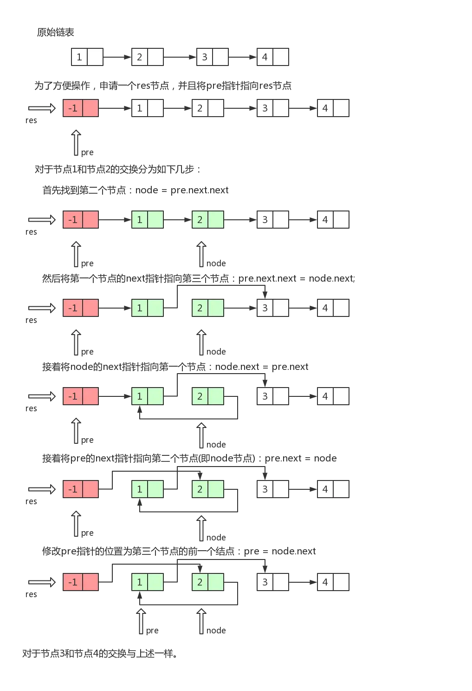

---
title: 24. Swap Nodes in Pairs
date: 2019-12-15 10:15:07
tags:
- 数组&链表
categories:
- leetcode
---

### 英文题目
Given a linked list, swap every two adjacent nodes and return its head.

You may not modify the values in the list's nodes, only nodes itself may be changed.

 

Example:
```
Given 1->2->3->4, you should return the list as 2->1->4->3.
```

### 中文题目
给定一个链表，两两交换其中相邻的节点，并返回交换后的链表。

你不能只是单纯的改变节点内部的值，而是需要实际的进行节点交换。

 

示例:
```
给定 1->2->3->4, 你应该返回 2->1->4->3.
```

### 思路
给定一个链表，两两交换其中相邻的节点，并返回交换后的链表。

示例:
```
给定 1->2->3->4, 你应该返回 2->1->4->3.
```
说明:

* 你的算法只能使用常数的额外空间。
* 你不能只是单纯的改变节点内部的值，而是需要实际的进行节点交换。

解题思路:

我们首先需要建立pre、node1、node2和lat四个指针即可。
```
pre   node1  node2   lat
 h  ->  1  ->  2  ->  3  ->  4
 ```
 
 然后pre->next=node2;node2.next=node1;node1.next=lat
 
 ```
      -----------
     |         |
h    1 <- 2 -> 3 -> 4
|         |
-----------

```

```
2->1->4->3.
```

### 图解

### 代码


```python
class ListNode:
    def __init__(self, x):
        self.val = x
        self.next = None


def createList():
    head = ListNode(1)
    cur = head

    for i in range(2, 5):
        cur.next = ListNode(i)
        cur = cur.next
    return head


def printList(head):
    cur = head
    while cur != None:
        print(cur.val, '-->', end='')
        cur = cur.next
    print('NULL')


class Solution:
    def swapPairs(self, head):
        """
        :type head: ListNode
        :rtype: ListNode
        """
        h = ListNode(-1)
        h.next = head
        pre = h
        while pre.next != None and pre.next.next != None:
            # 定义node1， node2.所以要node1， node2.
            node1 = pre.next
            node2 = node1.next
            lat = node2.next
            #变换顺序，重新赋值next，所以都是给next赋值。
            pre.next = node2
            node2.next = node1
            node1.next = lat

            pre = node1

        return h.next


if __name__ == "__main__":
    head = createList()
    printList(head)
    res = Solution().swapPairs(head)
    printList(res)

```

    1 -->2 -->3 -->4 -->NULL
    2 -->1 -->4 -->3 -->NULL

